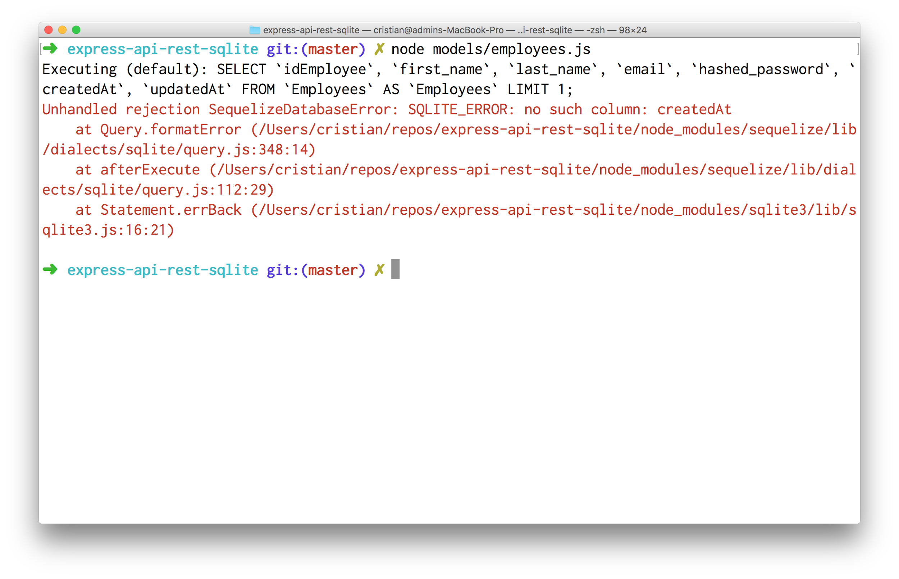
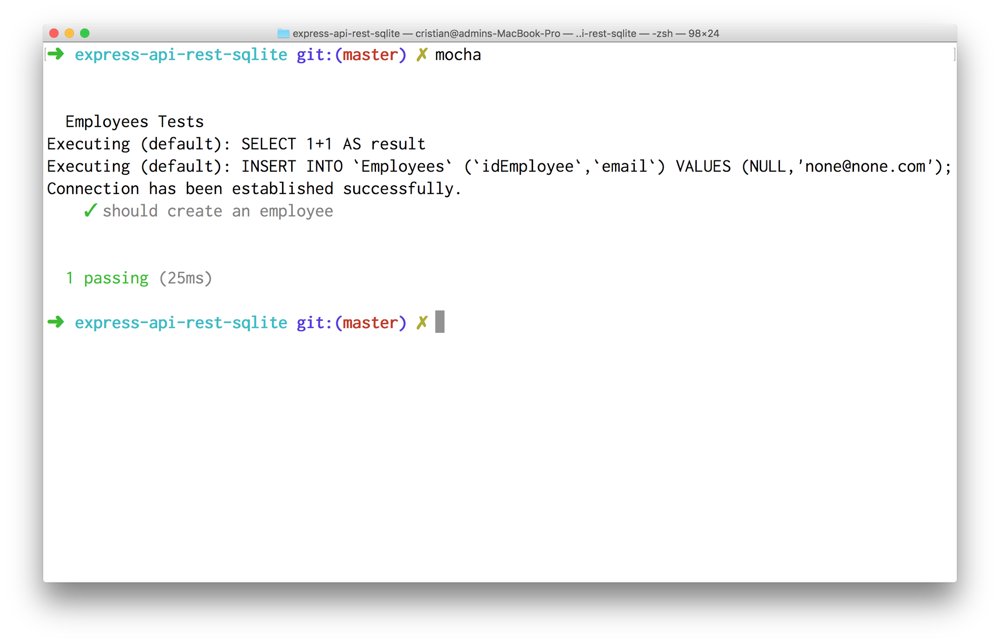

Building a Rest API with Sequelize & Express

To build a website with express we can use express generator.

```
$ yo express
```


We chose Basic, Jade (aka Pug) as View Engine and Grunt tasks, and we hope you finish the installation tasks npm install & bower install.

Once the operation is finished we open a second terminal and execute:

```
$ npm start

> express-api-rest-sqlite@0.0.1 start /Users/cristian/repos/express-api-rest-sqlite
> node ./bin/www

Express server listening on port 3000

```


If we open a new tab with our browser pointing to  http://localhost:3000/ we should see:


Since we pre-install grunt tasks it will be preferable that we use them during the development process. This will avoid things like having to reboot the server or send refreshments to the browser. So we do Ctrl + C and run the following command:

```
$ grunt
```


We will create a db folder and will host our database there (database.sqlite file).

```
$ mkdir db
```

We will leave this terminal open and then install some dependencies that will allow us to work with SQLite:

```
$ npm install --save sequelize sqlite
```

We create a connection file to our database and we will call it conn.js

```javascript
var Sequelize = require('sequelize');

var sequelize = new Sequelize('database', '', '',
      { storage: 'db/database.sqlite', dialect: 'sqlite'});

sequelize
  .authenticate()
  .then(function(err) {
    console.log('Connection has been established successfully.');
  })
  .catch(function (err) {
    console.log('Unable to connect to the database:', err);
  });

module.exports = sequelize;
```

When running it we should see the following:

```
$ node conn.js

Executing (default): SELECT 1+1 AS result
Connection has been established successfully
```

If we inspect this file with an SQLite viewer, in my case SQLite Browser we will see that there are two tables Employees and Administrators


We will then create a folder to save the models corresponding to our ORM layer

```
$ mkdir models
```

We will start by modeling employees by creating an employees.js file inside the models folder.

```javascript
var Sequelize = require('sequelize');

var sequelize = new Sequelize('database', '', '',
      { storage: 'db/database.sqlite', dialect: 'sqlite'});

var Employee = sequelize.define('Employees', {
	idEmployee      : { type : Sequelize.INTEGER, primaryKey : true, autoIncrement : true },
	first_name      : Sequelize.TEXT,
	last_name       : Sequelize.TEXT,
	email           : Sequelize.TEXT,
	hashed_password : Sequelize.TEXT
});

Employee.findOne().then(function(record){
	console.log(record.get('email'));
});

module.exports = Employee;
```

We created a model with the same fields in the table using sequelize.define, but when trying to execute this script we find the following error:



This is because sequelize attempts to use an additional pair of fields to save a date log on the createdAt and modified ( updatedAt ) operations . And because we do not have such a field in the schema of our table this error is triggered. Luckily we can tell you to sequelize that we do not want to operate with those additional fields by passing an additional configuration object on line 13

We proceed to execute our script and note that now the output was successful:


Let's make some changes to our model so that it is more modular and testable, assuming that we will receive only one connection object.

```javascript
var Sequelize = require('sequelize');
var sequelize = module.parent.exports.sequelize;

var Employee = sequelize.define('Employees', {
	idEmployee      : { type : Sequelize.INTEGER, primaryKey : true, autoIncrement : true },
	first_name      : Sequelize.TEXT,
	last_name       : Sequelize.TEXT,
	email           : Sequelize.TEXT,
	hashed_password : Sequelize.TEXT
}, {
	timestamps: false
});

module.exports = Employee;
```

Our script can continue to improve, but as a first improvement we will implement some tests which will be housed in a new folder called test.

```
$ mkdir test
```

Inside we will create the file unit-tests.js

```javascript
var assert = require('assert');
var sequelize = exports.sequelize = require('../conn.js');
var Employee = require('../models/employees.js');

describe('Employees Tests', function() {

  it('should create an employee', function(done) {
    Employee
      .create({email: 'none@none.com'})
      .then(function(record){
        assert.ok(record.get('email') === 'none@none.com', 'Email does not match');
        done();
      })
      .catch(function (err) {
        done(err);
      });
  });

});
```

Inside we will create the file unit-tests.js



We have achieved an acceptable version of one of our models, we now see how to integrate this with our website. For that we are going to make some modifications within the file app.js.

```diff
 app.use('/', routes);
 app.use('/users', users);


+var sequelize = exports.sequelize = require('./conn.js');
+var Employee = require('./models/employees.js');
+
+app.get('/employees', function(req, res){
+  Employee.findAll().then(function(result){
+    res.json(result);
+  });
+});
+

 /// catch 404 and forward to error handler
 app.use(function(req, res, next) {
     var err = new Error('Not Found');
```

If we now go to http://localhost:3000/employees


Consider using a tool such as httpie or postman to better appreciate the results:


The next thing we do is document the first endpoint of our API. For this we will use apidoc.

```
$ npm install -g apidoc
```

Before we can generate good documentation we need to add comments to our endpoint

```javascript
// more code...

app.use('/users', users);
var sequelize = exports.sequelize = require('./conn.js');
var Employee = require('./models/employees.js');

/**
 * @api {get} /employees Request Employees List
 * @apiName findAll
 * @apiGroup Employees
 *
 * @apiExample {curl} Example usage:
 *     curl -i http://localhost:3000/employees
 *
 * @apiSuccess {Array} List of employees objects
 */

app.get('/employees', function(req, res){
  Employee.findAll().then(function(result){
    res.json(result);
  });
});

/// catch 404 and forward to error handler
// more code...
```

After this we execute

```
$ apidoc -i . -f app.js -o public/
```

And then we have our site on port 3000, [http://localhost:3000/](http://localhost:3000/)


Excellent we already have the first documented endpoint for our api! We can add some automatic tests to make sure that it works correctly, we will create test/rest-tests.js:

```javascript
var assert = require('assert');
var superagent = require('superagent');
var d = "http://localhost:3000";
var agent;

describe("REST API", function(){

  before(function(){
    // Start agent
    agent = superagent.agent();
  });

  it('GET /employess', function(done){
    agent
      .get(d+'/employees')
      .end(function(err, res) {
        assert.ok(res.ok);
        assert.ok(res.body.length>0);
        done(err);
      });
  });

});
```

We proceed to execute this test:

```
$ mocha test/rest-tests.js
```


