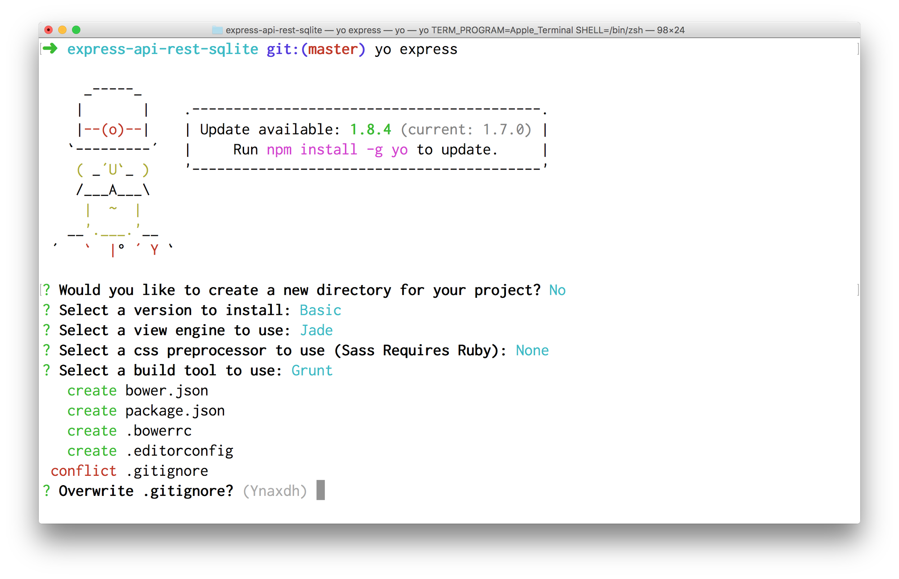
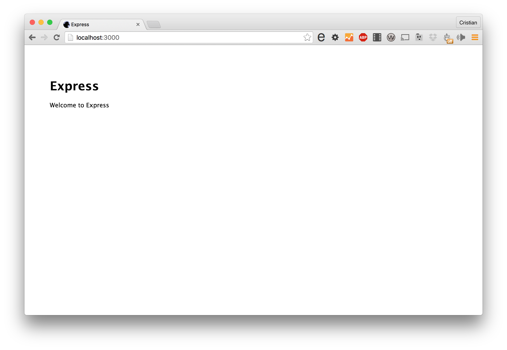
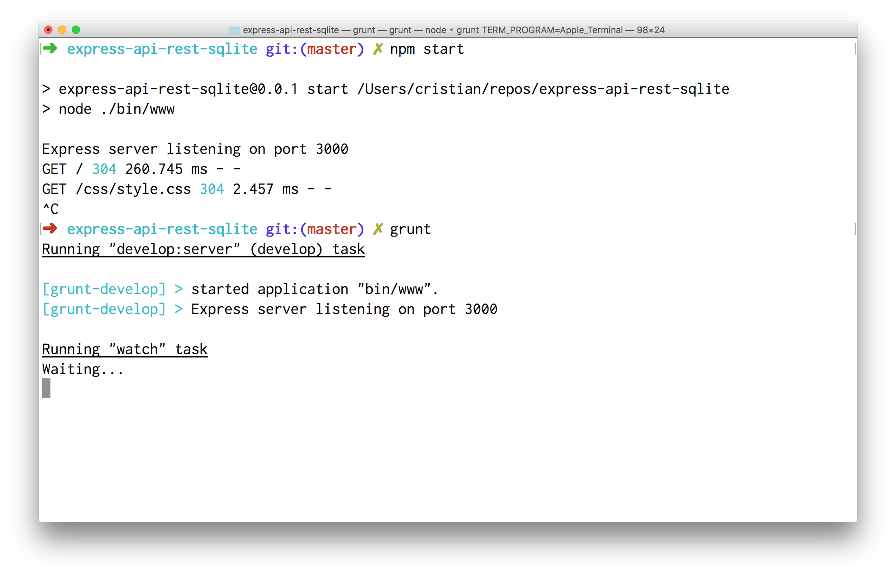
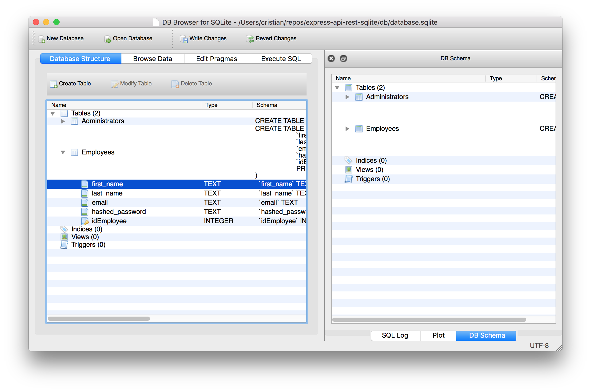
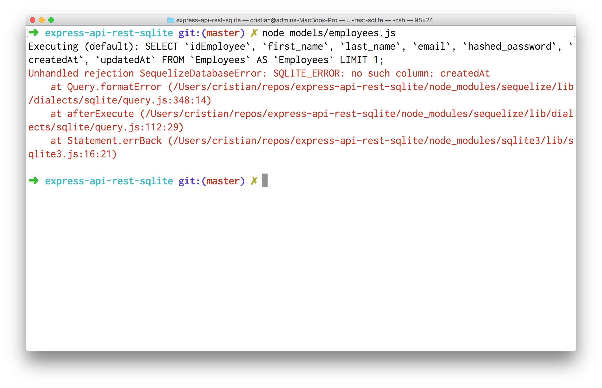
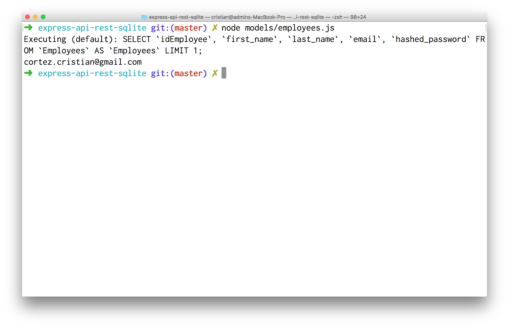
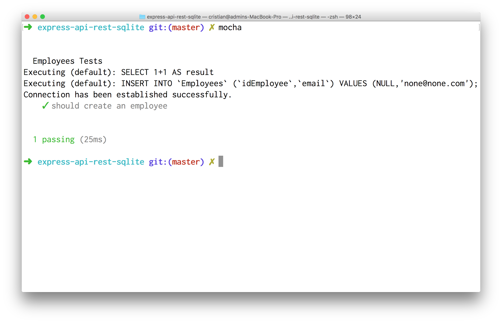
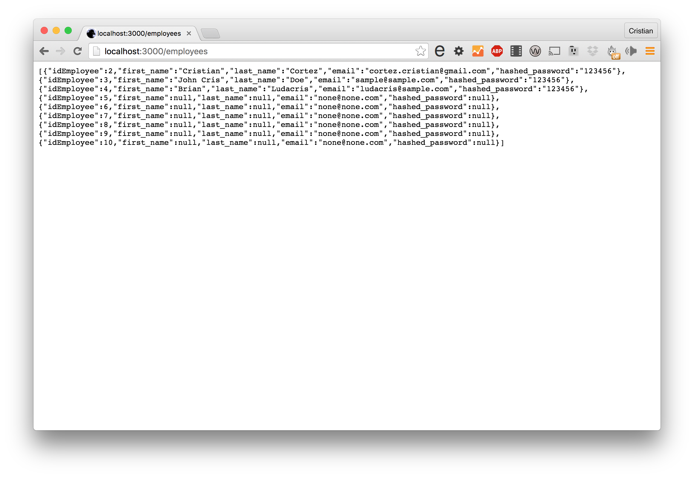
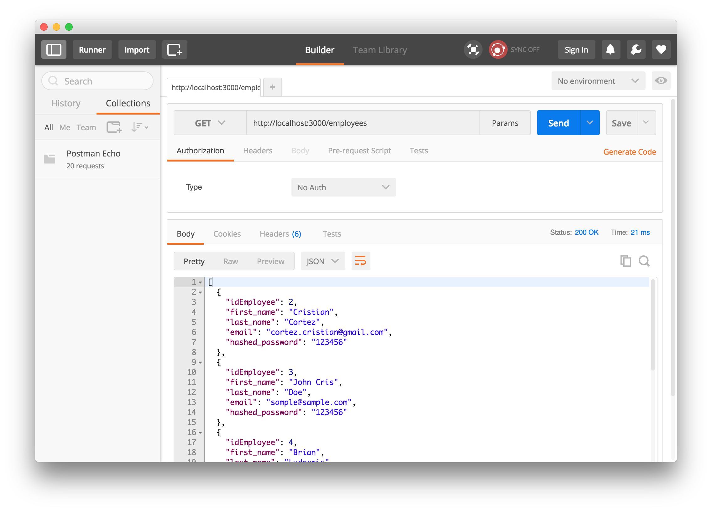
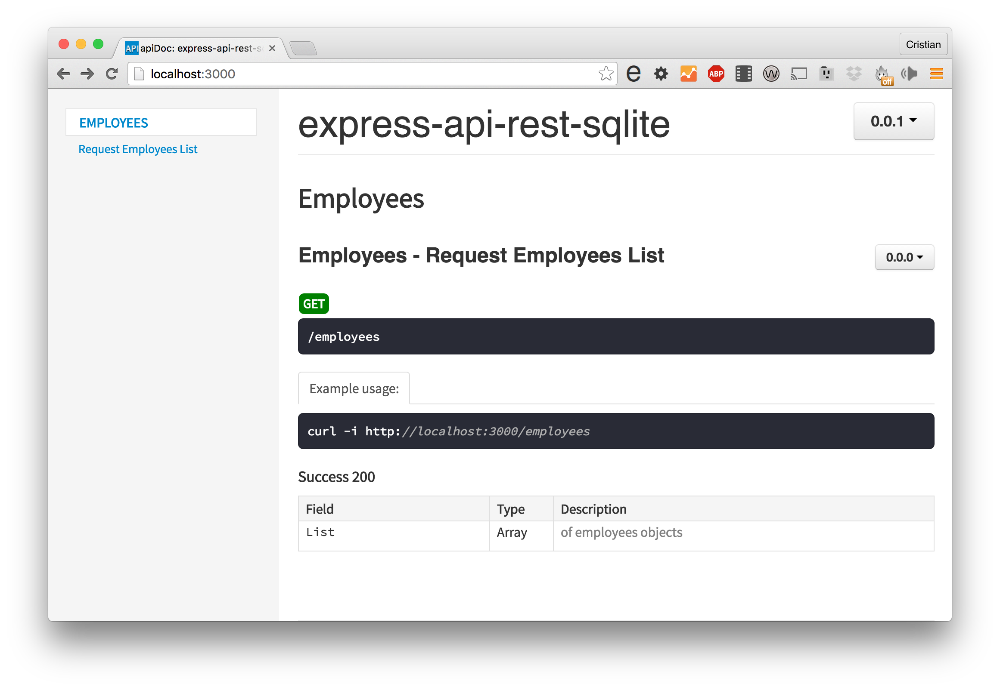

Construyendo una Rest API con Sequelize & Express

Para construir un sitio web con express podemos usar express generator.

```
$ yo express
```



Elegimos Basic, Jade (a.k.a. Pug) como View Engine y las tareas de Grunt, y esperamos que finalice las tareas de instalación npm install & bower install.

Una vez finalizada la operación abrimos una segunda terminal y ejecutamos:

```
$ npm start

> express-api-rest-sqlite@0.0.1 start /Users/cristian/repos/express-api-rest-sqlite
> node ./bin/www

Express server listening on port 3000

```

Si abrimos una nueva pestaña con nuestro navegador apuntando a http://localhost:3000/ deberíamos ver:



Ya que pre-instalamos las tareas de grunt será preferible que las usemos durante el proceso de desarrollo. Esto nos evitará cosas como tener que reiniciar el server o mandar refrescos al navegador. Por lo tanto hacemos Ctrl+C y corremos el siguiente comando:

```
$ grunt
```



Crearemos una carpeta db y alojaremos allí nuestra base de datos (archivo database.sqlite).

```
$ mkdir db
```

Dejaremos esta terminal abierta y a continuación instalaremos algunas dependencias que nos permitirán trabajar con SQLite:

```
$ npm install --save sequelize sqlite
```

Creamos un archivo de conexión a nuestra base de datos y lo llamaremos conn.js

```javascript
var Sequelize = require('sequelize');

var sequelize = new Sequelize('database', '', '',
      { storage: 'db/database.sqlite', dialect: 'sqlite'});

sequelize
  .authenticate()
  .then(function(err) {
    console.log('Connection has been established successfully.');
  })
  .catch(function (err) {
    console.log('Unable to connect to the database:', err);
  });

module.exports = sequelize;
```

Al ejecutarlo deberíamos ver los siguiente:

```
$ node conn.js

Executing (default): SELECT 1+1 AS result
Connection has been established successfully
```

Si inspeccionamos dicho archivo con un visor de SQLite, en mi caso SQLite Browser veremos que hay dos tablas Employees y Administrators



Crearemos entonces una carpeta para guardar los modelos correspondientes a nuestra capa de ORM

```
$ mkdir models
```

Iniciaremos por modelar a los empleados creando un archivo employees.js dentro de la carpeta models.

```javascript
var Sequelize = require('sequelize');

var sequelize = new Sequelize('database', '', '',
      { storage: 'db/database.sqlite', dialect: 'sqlite'});

var Employee = sequelize.define('Employees', {
	idEmployee      : { type : Sequelize.INTEGER, primaryKey : true, autoIncrement : true },
	first_name      : Sequelize.TEXT,
	last_name       : Sequelize.TEXT,
	email           : Sequelize.TEXT,
	hashed_password : Sequelize.TEXT
});

Employee.findOne().then(function(record){
	console.log(record.get('email'));
});

module.exports = Employee;
```

Creamos un modelo con los mismos campos de la tabla usando sequelize.define, pero al intentar ejecutar este script nos encontramos con el siguiente error:



Esto se debe a que sequelize intenta usar un par de campos adicionales para guardar un log de fecha sobre las operaciones de alta (*createdAt*) y modificación (*updatedAt*). Y debido a que no tenemos dicho campo en el schema de nuestra tabla se dispara este error. Por suerte podemos indicarle a sequelize que no deseamos operar con esos campos adicionales pasando un objeto de configuración adicional en la línea 13

Procedemos a ejecutar nuestro script y notamos que ahora la salida fue exitosa:



Hagamos unos cambios a nuestro modelo para que sea mas modular y testeable, asumiendo que siemplre recibiremos un sólo objeto de conexion.

```javascript
var Sequelize = require('sequelize');
var sequelize = module.parent.exports.sequelize;

var Employee = sequelize.define('Employees', {
	idEmployee      : { type : Sequelize.INTEGER, primaryKey : true, autoIncrement : true },
	first_name      : Sequelize.TEXT,
	last_name       : Sequelize.TEXT,
	email           : Sequelize.TEXT,
	hashed_password : Sequelize.TEXT
}, {
	timestamps: false
});

module.exports = Employee;
```

Nuestro script podrá seguir mejorado, pero como primer mejora implementaremos algunos tests los cuales alojaremos en una nueva carpeta llamada test.

```
$ mkdir test
```

Dentro crearemos el archivo unit-tests.js

```javascript
var assert = require('assert');
var sequelize = exports.sequelize = require('../conn.js');
var Employee = require('../models/employees.js');

describe('Employees Tests', function() {

  it('should create an employee', function(done) {
    Employee
      .create({email: 'none@none.com'})
      .then(function(record){
        assert.ok(record.get('email') === 'none@none.com', 'Email does not match');
        done();
      })
      .catch(function (err) {
        done(err);
      });
  });

});
```

Si ejecutamos la suite, veremos lo siguiente:



Hemos logrado una versión aceptable de uno de nuestros modelos, vemos ahora como integrar esto con nuestro sitio web. Para eso vamos a realizar algunas modificaciones dentro del archivo app.js.

```diff
 app.use('/', routes);
 app.use('/users', users);


+var sequelize = exports.sequelize = require('./conn.js');
+var Employee = require('./models/employees.js');
+
+app.get('/employees', function(req, res){
+  Employee.findAll().then(function(result){
+    res.json(result);
+  });
+});
+

 /// catch 404 and forward to error handler
 app.use(function(req, res, next) {
     var err = new Error('Not Found');
```

Si ahora vamos a http://localhost:3000/employees



Consideren usar alguna herramienta como httpie o PostMan para poder apreciar mejor los resultados:



Lo siguiente que haremos será documentar el primer endpoint de nuestra API. Para ello utilizaremos apidoc.

```
$ npm install -g apidoc
```

Antes de poder generar una buena documentación precisamos agregar comentarios a nuestro endpoint

```javascript
// more code...

app.use('/users', users);
var sequelize = exports.sequelize = require('./conn.js');
var Employee = require('./models/employees.js');

/**
 * @api {get} /employees Request Employees List
 * @apiName findAll
 * @apiGroup Employees
 *
 * @apiExample {curl} Example usage:
 *     curl -i http://localhost:3000/employees
 *
 * @apiSuccess {Array} List of employees objects
 */

app.get('/employees', function(req, res){
  Employee.findAll().then(function(result){
    res.json(result);
  });
});

/// catch 404 and forward to error handler
// more code...
```

Luego de esto ejecutamos

```
$ apidoc -i . -f app.js -o public/
```

Y luego de esto vistamos nuestro sitio en el puerto 3000, [http://localhost:3000/](http://localhost:3000/)



Excelente ya tenemos el primer endpoint documentado para nuestra api!

